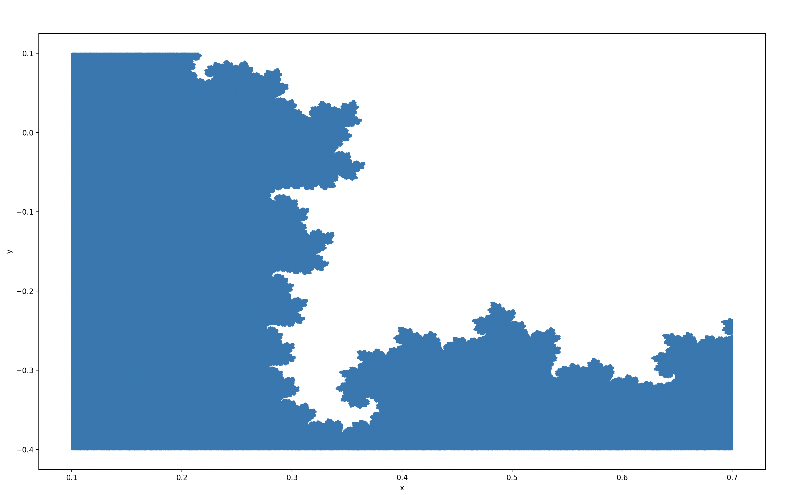
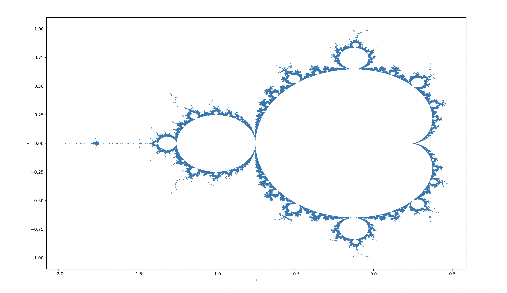
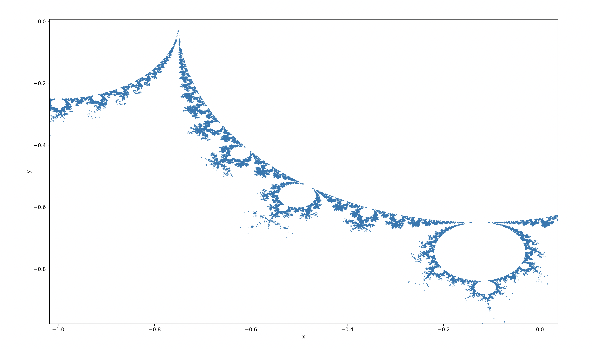
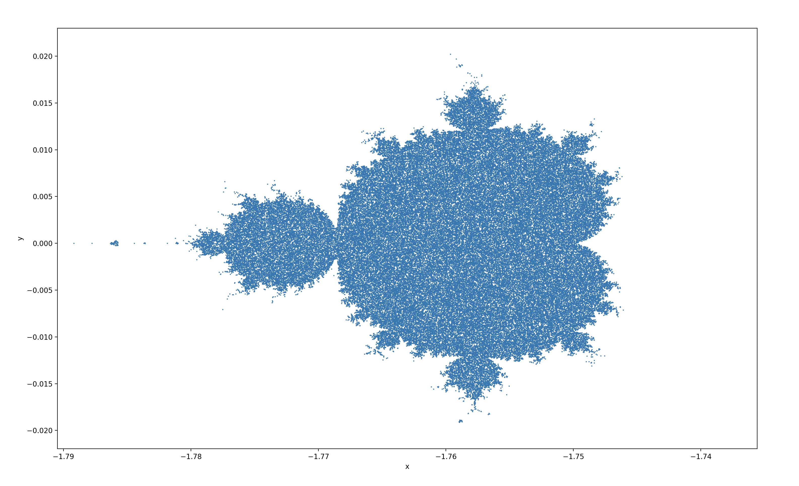
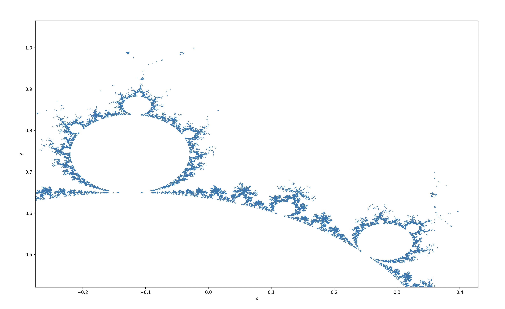

# Factorial Generator
A python project I made a while ago that computes points on various kinds of fractals / cool shapes! Now, it's been updated with many features such as border displaying, bound setting, function depth, and point counts!

## Setup:
- Open a virtual python environment on your VS Code terminal (if using VS)
- Open a new python terminal
- If not already, install matplotlib and pandas
    - This can be done with `$ pip install matplotlib` and `$ pip install pandas`
- You should be good to go! Read the instructions for each function if you use it!

## shapes.py
This function takes in a constant complex number, inputted with the prompt `a + bi`, where `a` is represented by `c` and `b` is represented by `d` within the code. Then, points are randomly generated, upon which the constant number is added, then the result is entered into the function again. Whichever points do not diverge to infinity are kept within the shape.

### Inputs
- `a` and `b`: The user can enter the complex number here. Recommended: Both between -1 and 1.
- `Depth`: This is the amount of times the function is executed. Generally, greater depths tend to allow less points to pass the test. Recommended: 5-15.
- `Bounds (x1 x2 y1 y2)`: This is simply the boundaries in which points are generated. Recommended: -2 2 -2 2.
- `Point Count`: This is how many points are generated. The time can vary since shapes will have different sizes and 'tolerance'. If you don't see updates in desired time, consider changing your depth / point count / constant.

### Output 
While calculating your points, the program will display messages telling you how many have been created. When it's done, a graph should automatically open on your computer, showing your completed shape. The graph can be manipulated using matplotlib's tools.

Suppose you have the following graph, generated with: 
 `a: -0.2` 
 `b: 0.627` 
 `Depth: 200` 
 `Bounds: 0.1 0.7 -0.4 0.1` 
 `Point Count: 20000000` 

You can zoom into the area selected here:

Then, your graph will look like this:

Note: Since there were 20 million points generated, this graph in particular will look solid. However, upon zooming further, you would be able to see the dots.

## mandelbrot.py
This function generates an image of the mandelbrot set, with varying degrees of depth and the option to have a border.

### Inputs
- `Depth`: This is the number of times the function iterates. A higher depth is a more accurate Mandelbrot set. Recommended: Less than 200.
- `Bounds (x1 x2 y1 y2)`: This is the bounds between which points are generated. Recommended: -2 0.5 -1 1.
- `Point Count`: This is the number of points generated. Recommended: < 100000 if making a border, otherwise, as high as you want.
- `Only show a border?:` If answered yes, you will be displayed with a border of the Mandelbrot set rather than the filled in set itself. 

### Output
Again, the program automatically displays progress messages while calculating the points. When done, the graph will open automatically on your computer.

The following graph is with the settings: 
`Depth: 100` 
`Bounds: -2 0.5 -1 1` 
`Point Count: 300000` 
`Only show borders: y`

This graph took many hours to render due to how thin the borders were. However, the result was worth it:

Zooming into the graph, I collected some of my favorite snapshots. 

View them here

Shot 1

Shot 2

This one is particularly interesing in that it seems to be a mini-version of the set, located far to the left of the original

Shot 3

